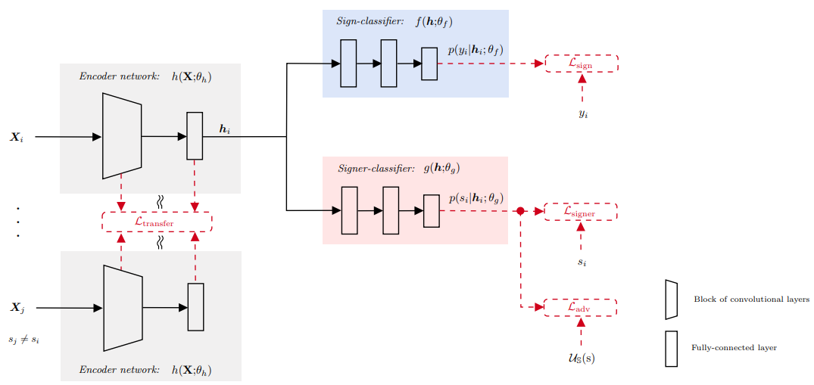

# SI-SLR
Learning Signer-Invariant Representations with Adversarial Training

## Description
Source code for the implementation of the **Signer-Invariant Sign Language Recognition Neural Network**, as described in the paper:

**Ferreira, P. M., Pernes, D., Rebelo, A., and Cardoso, J. S.. Learning signer-invariant representations with adversarial training. In The 12th International Conference on Machine Vision (ICMV 2019)**

|   |
|:---:|

## Example of Usage

***Train:*** 
~~~bash
python run.py --adv_weight=0.6 --transf_weight=0.0002 --model=transf_cnn --dataset=staticSL --gpu=0 --mode=train
~~~

***Test:*** 
~~~bash
python run.py --adv_weight=0.6 --transf_weight=0.0002 --model=transf_cnn --dataset=staticSL --gpu=0 --mode=train
~~~

## Datasets
**Jochen-Triesch database**: Jochen Triesch and Christoph von der Malsburg. A system for person-independent hand posture recognition against complex backgrounds. IEEE Trans. Pattern Anal. Mach. Intell., 23(12):1449–1453, December 2001.

**Microsoft Kinect and Leap Motion American sign language dataset**: Giulio Marin, Fabio Dominio, and Pietro Zanuttigh. Hand gesture recognition with jointly calibrated leap motion and depth sensor. Multimedia Tools and Applications, 75(22):14991–15015, Nov 2016.
